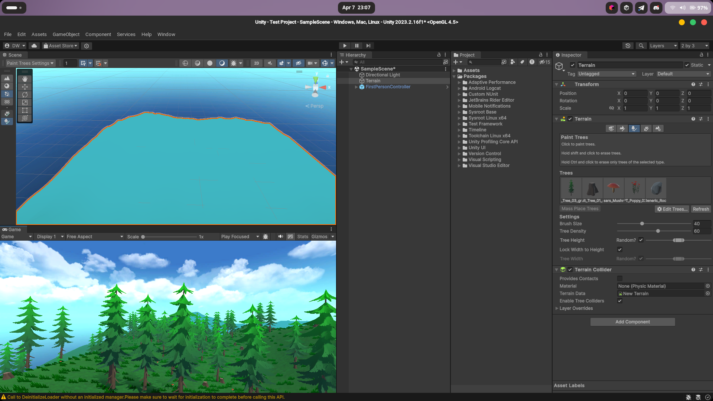
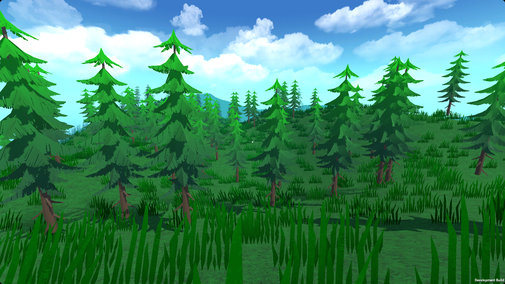
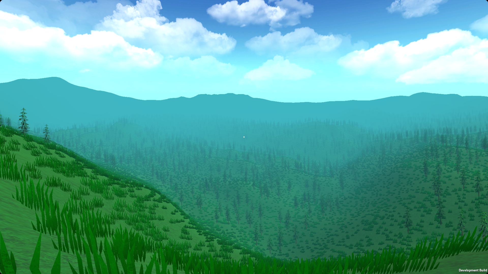
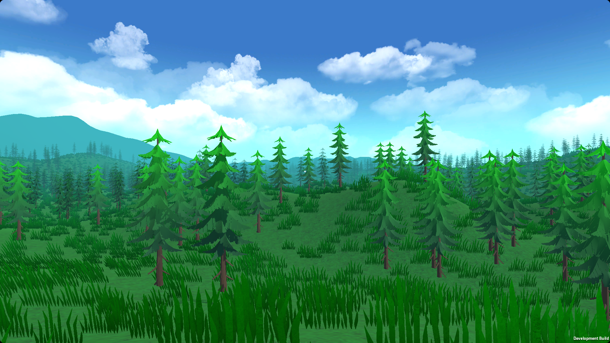
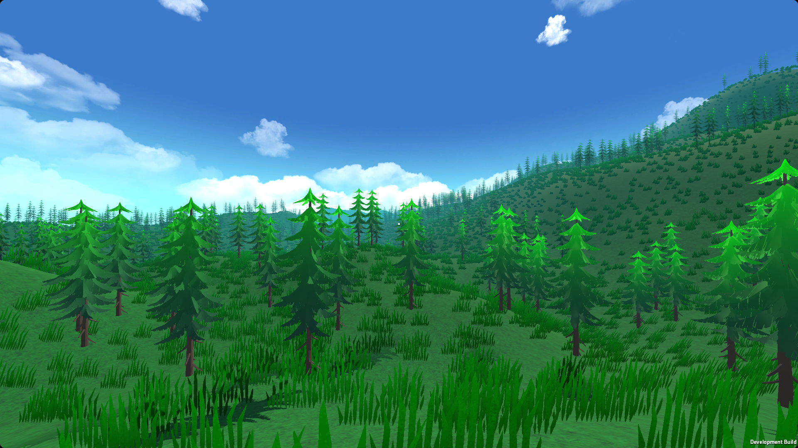

# 3D Open World Demo With Unity

## Description:
* it's my first 3D open world demo with unity 
* there's an `executable` named `test.x86_64` 
that you can run it on linux *only* with `./test.x86_64` in your desired terminal.

## Screenshots:

